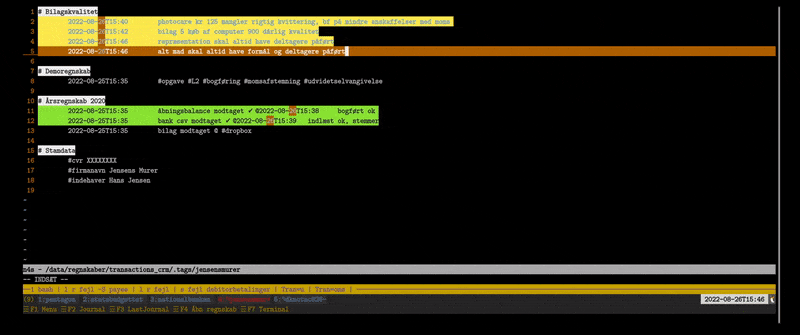

# Demo Video - Kontering af simpelt regnskab?

Vil du gerne se hvordan systemet betjenes i det daglige ?

[Video Tutorial / Demonstration - hvordan konteres et simpelt regnskab i n4s](https://drive.google.com/file/d/1nwrxOqLnyxyygyskKH82jMwOPyTXERfQ/view?usp=sharing)
# TLDR - Lad mig downloade din OVA
* Link til [Virtualbox OVA appliance](https://drive.google.com/file/d/1xXEZJA-olt_NsVIXKmzxiJH8xKX38ydh/)
* Link til [Virtualbox Multi Platform Download](https://www.virtualbox.org/wiki/Downloads) (husk at få Extension Pack også)

Fordele ved OVA Løsning:
* Hurtigt i gang
* Nem at sikkerhedskopiere - lav snapshots nemt i Virtualbox

Ulemper:
* Størrelse 20GB da den indeholder et helt operativsystem plus ekstra plads så du ikke løber tør (n4s fylder < 70MB)

# Import / Export
	n4s understøtter import/eksport af CSV-filer
	Særligt nyttigt hvis man vil indlæse et kontoudtog fra bank eller lign.

# Eksempel på rapportering
Rapportering af resultat & balance på overordnet kontoniveau med tilknyttede noter.
Eksempel regnskab Jensens Murer ApS 2020 (fiktivt selskab)
* [Eksempel saldobalance](https://drive.google.com/file/d/1WAlPO73OykvF5-wUCh9-XDIikK_8SoBU/view?usp=sharing)
* [Eksempel kontokort](https://drive.google.com/file/d/1d_se9vbtTHx38qCeMm4gSxC0gy9byxez/view?usp=sharing)

# Kom hurtigt i gang
Hvis du vil hurtigt i gang og have en introduktion kan du booke et zoom-møde til favorabel intro-pris.
Det forventes at du har downloadet vores OVA samt Virtualbox med Extension Pack, og at du har Zoom installeret
Det forventes at du er nogenlunde teknisk kyndig.
Vi vil vise dig hvordan du:
* Opretter regnskaber
* Indtaster transaktioner
* Importerer bank CSV filer
* Genererer balancer og kontokort

samt besvare evt. spørgsmål du måtte have.

[Book din tid her](https://n4s-linux-regnskab.youcanbook.me)

# Frit regnskabssystem
Vi mener der skal være et lynhurtigt og sikkert bogføringssystem som kan køre lokalt på enhver computer (eller telefon/ipad/brødrister, – linux kan køre på næsten alt) til de nye iværksættere / små selvstændige. Det skal også kunne køre på f.eks. en linode 5$ server og betjenes af flere samtidige brugere.

# Support
Der ydes foreløbig *gratis* support til brug af den virtuelle maskine. Kontakt herom på email olsenit@gmail.com

# n4s - Open Source / Fri Software GNU/Linux baseret dobbelt bogholderi og ERP
n4s er et terminalbaseret system til brug for dobbelt bogholderi (finans, debitor, kreditor).
Det kan køre på en fysisk GNU/Linux computer eller en VPS i skyen.
Det kan også køres på Windows 10+ såfremt man aktiverer WSL (Windows Linux Subsystem)
Systemet er bygget i PHP og BASH og benytter den populære teksteditor vim (VI Improved), terminalmultiplexeren tmux, samt det tekstbaserede double entry regnskabsprogram ledger-cli samt hledger

Funktioner:
* Avanceret udvidet filstruktur og versionering og sporing på data/transaktioner.
* Periodisering
* Momskoder
* Årsafslutning
* Rapport generator og transaktions-stifinder (webapplikation samt tekstbaseret)
* Import af transaktioner fra CSV eller live bank forbindelse
* Automatisk beregning af rente hvor man kan specificere rentesatsen på en given konto
* Automatisk periodisering hvor man på hver udgift kan angive en start og slutdato
* Automatisk konsolidering
* Bankafstemning
* Logik / regler – mulighed for at definere regler for automatisk kontering af posteringer
* Søgning efter transaktioner og masseopdatering udfra specificerbare kriterier
* Præsentabel rapportering (saldobalancer og kontokort)
* Mulighed for at generere links for en given regnskabsperiode for et regnskab som kan åbnes uden login, hvor man kan se saldobalancen og gennemse de bagvedliggende posteringer.
* Skatteregnskab – manuel
* Bilagshåndteringssystem
* Værktøj til effektiv oprettelse af transaktioner
* Indlæsning af OIOUBL (XML) fakturaer
* Simpel Automatisk konsolidering af koncernregnskaber

# Krav til installation
En frisk installation af debian, ubuntu eller en anden debian-baseret distribution
Kan også installeres på andre distributioner, programafhængigheder kan findes i Libraries/Dependencies_Debian.txt
Den nemmeste måde at installere det på er ved at downloade være prækonfigurerede Virtualbox Appliance, instruktioner nedenfor

# Guide til Import og Kørsel af en OVA-fil i VirtualBox

I denne vejledning vil vi guide dig gennem trinnene til at importere og køre en OVA-fil (Open Virtualization Appliance) i VirtualBox. En OVA-fil indeholder typisk et komplet operativsystem, og VirtualBox er en populær virtualiseringssoftware til at køre virtuelle maskiner.

## Forudsætninger

Inden du begynder, skal du sørge for at have følgende:

- **VirtualBox:** Hent og installer VirtualBox fra den officielle hjemmeside (https://www.virtualbox.org/wiki/Downloads).

*Vigtigt du skal både downloade virtualbox og installere Virtualbox VM Extension Pack for optimal ydelse*

## Trin

1. **Åbn VirtualBox:**
   - Start VirtualBox-applikationen på din computer.

2. **Importer OVA-fil:**
   - Klik på menuen "Filer" i VirtualBox.
   - Vælg "Importer apparat" fra menuen.

3. **Vælg OVA-fil:**
   - I dialogboksen "Apparat, der skal importeres", skal du klikke på mappeikonet for at browse og vælge den OVA-fil, du ønsker at importere.
   - Klik på "Næste" for at fortsætte.

4. **Indstillinger for apparatet:**
   - Gennemgå indstillingerne for den virtuelle maskine i skærmbilledet "Indstillinger for apparatet".
   - Du kan ændre indstillinger som navn, CPU og hukommelsesallokering, hvis det er nødvendigt.
   - Klik på "Importer" for at fortsætte.

5. **Importproces:**
   - VirtualBox begynder nu at importere OVA-filen.
   - Denne proces kan tage noget tid, afhængigt af OVA-filens størrelse og din computers ydeevne.

6. **Import fuldført:**
   - Når importprocessen er færdig, vises en bekræftelsesmeddelelse.
   - Klik på "Acceptér", hvis du bliver bedt om at acceptere licensvilkårene.

7. **Virtuel maskine tilføjet:**
   - Den virtuelle maskine, der svarer til den importerede OVA-fil, vises nu i VirtualBox-manageren.

8. **Start den virtuelle maskine:**
   - Vælg den virtuelle maskine fra listen.
   - Klik på knappen "Start" i VirtualBox-manageren.

9. **Logins til den virtuelle maskine**
* Brugernavn: n4s
* Password bruger: n4s
* Diskkrypteringskode: n4s
* Root kode: n4s

10. **Kør programmet:**
    - Når opsætningen af operativsystemet er fuldført, kan du køre programmet inden for den virtuelle maskine.
    - Installer software, surf på nettet og udfør forskellige opgaver inden for det virtuelle miljø.

11. **Aflukning:**
    - For at lukke den virtuelle maskine kan du blot klikke på "Afluk" eller "Sluk" i det virtuelle operativsystem eller bruge VirtualBox-manageren til at slukke for den.

12. **Afslut VirtualBox:**
    - Når du er færdig med at bruge den virtuelle maskine, kan du lukke VirtualBox.

# Installation på eksisterende GNU/Linux System
## Installation af GIT
	sudo apt-get install git -y

## Hentning af n4s
	git clone git@github.com:n4s-linux/n4s.git
## Installation af n4s (enkeltbrugersystem)
	cd n4s
	./install.sh
Herefter genstart computeren / serveren.
# Brug
## Start n4s
	n4s
## Start et regnskab
* Tryk F1 (menu)
* Vælg Regnskab
* Vælg Åbn Regnskab
* Vælg NY
* Skriv navnet på dit regnskab
## Din første transaktion
* Frembring regnskabsmenu (Alt-M)
* Vælg Opret postering
* Indtast dato [ENTER] - dato indtastet i formatet YYYY-mm-dd f.eks. 2022-01-31
* Indtast bilagsnummer / reference [ENTER]
* Indtast transaktionstekst [ENTER]
* Vælg konto fra listen - skriv hvad du vil søge efter f.eks. telefon hvor du kan vælge "Udgifter:Administration:Telefoni" [ENTER]
* Tast beløb (debet/kredit) [ENTER]
* Vælg funktion (momskode - hvis der ikke er momsfradrag vælg Ingen) [ENTER]
* Vælg modkonto f.eks. skriv bank og vælg "Aktiver:Likvider:Bank"
* Tryk [ENTER] for at genbruge den omvendte balancesum fra den tidligere transaktion 
* Vælg Ingen funktion (momskode) på modkonto [ENTER]
* Såfremt du har lavet en fejl eller ønsker at kontrollere transaktionen kan du nu trykke 'e' for at redigere den i vim eller enter for at fortsætte.

# N4S
n4s er en samling af fri software til linux.
Det er en samling scripts og bindeled mellem følgende populære foss-programmer: ledger-cli, tmux, php, bash.

# Bogføring i n4s
n4s primære funktion er bogføring.

Datastruktur:
	* Hvert regnskab er en mappe
	* Hvert bilag er en fil med en række transaktioner (typisk 2-benede).
	* Konkrete ændringer i bilagsregistreringer logføres med navn, tidspunkt og præcise ændringer.

# Kom i gang
# Før du går i gang
Se hvordan vi bogfører et simpelt regnskab i vores [demo video](https://drive.google.com/file/d/1nwrxOqLnyxyygyskKH82jMwOPyTXERfQ/view?usp=sharing) - der kan du også se hvilke taster vi trykker for at tilgå de fleste funktioner

# Hovedmenu
Hovedmenu tilgås på F1

# Regnskabsmenu (virker kun når du har åbnet et regnskab)
Regnskabsmenu med diverse funktioner kan tilgås med Alt-m når du har åbnet et regnskab

# Opret nyt regnskab / regnskabsmappe
* Tryk F4. 
* Vælg NY, 
* Skriv et navn på dit regnskab

# Åbn et eksisterende regnskab
	Tryk F4
	Vælg det ønskede regnskab

# Din første transaktion
*Tryk 'e'
* Følg guiden på skærmen
# Søg en transaktion frem
* Søg med 's' Enter for at søge i den aktuelle periode (ændres med Alt-p)
* Søg med 'ss' Enter for at søge i alle perioder

# Hvordan eksporterer man rapporteringen
Indstil først periode med Alt-p som du ønsker at rapportere for
skriv herefter 'html' Enter
Den vil spørge efter firmanavn som skal indtastes første gang - det er til tekst på forsiden af rapporten - der kan evt. medtages andre noter
Herefter vil saldobalance og kontokort ligger i tmp-mappen som kan åbne i filmanageren i venstre side

# Sagsstyring / stamdatakartotek / wikisystem
n4s har også et wikisystem hvor man kan holde styr på kunderer, varer, reservedele, viden e.t.c.

# Genvejstaster terminal multiplexer - tmux - terminalvinduehåndteringen
## Navigering i vinduer

| Tastaturgenvej    | Handling                    |
| ----------------- | ----------------------------|
| Alt+1             | Skift til vindue 1          |
| Alt+2             | Skift til vindue 2          |
| Alt+3             | Skift til vindue 3          |
| Alt+4             | Skift til vindue 4          |
| Alt+5             | Skift til vindue 5          |
| Alt+6             | Skift til vindue 6          |
| Alt+7             | Skift til vindue 7          |
| Alt+8             | Skift til vindue 8          |
| Alt+9             | Skift til vindue 9          |
| Alt+Venstre Pil   | Skift til foregående vindue |
| Alt+Højre Pil     | Skift til næste vindue      |

## Hovedmenu

| Tastaturgenvej    | Handling                   |
| ----------------- | -------------------------- |
| c                 | Åbn Journaler (Sager)     |
| r                 | Åbn Regnskab              |
| T                 | Åbn Terminal              |
| K                 | Åbn Kommunikation         |
| t                 | Åbn Tid                   |
| s                 | Åbn Statistik             |
| m                 | Åbn Manual                |
| C                 | Åbn Lommeregner (Python)  |

## Journaler (Sager)

| Tastaturgenvej    | Handling                           |
| ----------------- | ---------------------------------- |
| c                 | Åbn Journaler (Sager)              |
| m                 | Åbn Materialeindkaldelse-menuen   |

## Regnskab

| Tastaturgenvej    | Handling                           |
| ----------------- | ---------------------------------- |
| r                 | Åbn Rapportering-menuen           |
| R                 | Åbn Kontokort-menuen for aktuel periode |
| u                 | Åbn Udskrift-menuen for konti     |
| c                 | Åbn CSV-menuen for en specifik konto |

# Terminal

| Tastaturgenvej    | Handling                           |
| ----------------- | ---------------------------------- |
| T                 | Åbn en ny terminalvindue          |
| s                 | Tag et screenshot af det aktuelle vindue |
| S                 | Se tidligere screenshots          |

# Manual

| Tastaturgenvej    | Handling                           |
| ----------------- | ---------------------------------- |
| m                 | Åbn LICENS-siden                  |
| t                 | Åbn n4s - Bogføringssystem (tmux-vinduessystem) |
| v                 | Åbn Vim - Editor-siden            |
| u                 | Åbn tmux - Vinduesystem-siden     |
